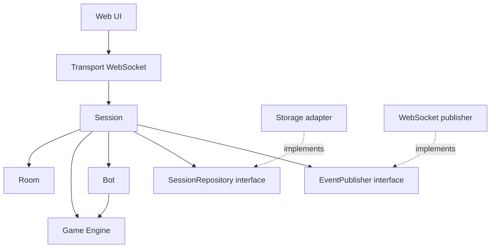

# Architecture technique — Belote Contrée v1.0

## 1. Décision

Monorepo pnpm, TypeScript strict de bout en bout, PWA React + Vite + Tailwind, serveur Node.js LTS + Fastify + WebSocket, moteur métier partagé, tests Vitest et Playwright. Déploiement unique sous Docker Compose et reverse proxy HTTPS/WSS sur VPS. Éviter les microservices et Kubernetes.

Vérifier et figer les versions **stables actuellement disponibles** dans le manifeste lors de l'initialisation. Ne pas laisser d'intervalle `latest` en production et committer le lockfile.

## 2. Arborescence visée

```text
belote-contree/
  apps/
    web/
      src/features/{lobby,game}/
      src/components/
      src/transport/
      public/
    server/
      src/modules/{room,session}/
      src/adapters/{http,websocket,persistence}/
      src/main.ts
  packages/
    game-engine/src/{core,cards,bidding,tricks,scoring}/
    bot/src/
    protocol/src/
  docs/
    requirements.md
    game-rules.md
    domain-model.md
    architecture.md
    test-matrix.md
    decisions.md
  prompts/01-bootstrap-codex.md
  pnpm-workspace.yaml
  package.json
  compose.yaml
```

**Premier lot** : créer les workspaces mais implémenter uniquement `game-engine/core` et `game-engine/cards` avec leurs tests. `bot`, `protocol`, `web` et `server` ne doivent pas contenir de fausse logique métier à ce stade.

## 3. Responsabilités

- `game-engine/core` : types métier, identifiants de places et d'équipes, erreurs, contrats d'état, aucune dépendance plateforme.
- `game-engine/cards` : création, validation et mélange d'un paquet complet, distribution déterministe d'un paquet injecté, calcul des valeurs/rangs.
- `game-engine/bidding` : enchères, fin par passes, contre hors tour, fenêtre de surcontre.
- `game-engine/tricks` : cartes légalement jouables, évaluation des plis, dix de der et capot.
- `game-engine/scoring` : résultats, belote, forfaits, arrondis, score cible.
- `game-engine` façade : cycle d'une partie, commandes, événements, projections des vues privées.
- `room` : salons, places, équipes, identités temporaires.
- `session` : identification de l'acteur, validation d'autorisation, sérialisation des commandes d'un salon, persistance, publication.
- `bot` : choisit parmi les actions légalement accessibles au bot sur la base de sa seule vue.
- `protocol` : schémas des messages publics et privés, validations aux frontières.
- `web` : interface et adaptateurs réseau/local, jamais source d'autorité en ligne.

## 4. Dépendances autorisées



Aucun sous-module du moteur n'importe React, navigateur, Fastify, Node, WebSocket, réseau ou base de données. Les sous-modules `cards`, `bidding`, `tricks`, `scoring` dépendent seulement de `core` ; la façade orchestre ces sous-modules. Ne pas introduire de cycle d'imports.

## 5. Contrats applicatifs conceptuels

```typescript
interface GameEngine {
  startDeal(state: GameState, deck: ShuffledDeck): GameResult;
  execute(state: GameState, command: GameCommand): GameResult;
  getLegalActions(state: GameState, seat: SeatId): LegalAction[];
  getPlayerView(state: GameState, seat: SeatId): PlayerView;
}
interface GameResult { state: GameState; events: GameEvent[]; }
interface SessionRepository {
  get(roomId: string): Promise<SessionSnapshot | null>;
  save(snapshot: SessionSnapshot, expectedVersion: number): Promise<void>;
  delete(roomId: string): Promise<void>;
}
interface EventPublisher {
  sendToPlayer(participantId: string, message: ServerMessage): Promise<void>;
  broadcastPublic(roomId: string, message: PublicMessage): Promise<void>;
}
```

Les types ci-dessus sont conceptuels : ne pas fabriquer de faux objets `GameState` uniquement pour satisfaire le compilateur pendant le premier lot. Chaque lot les affine au moment utile.

## 6. Intégrité et confidentialité

Le serveur est autoritaire en Internet. Chaque commande inclut `commandId` et `expectedVersion`. Les commandes d'un même salon sont traitées atomiquement, les commandes rejouées sont reconnues, les vues distribuées sont filtrées par place. Les identifiants privés de reconnexion sont aléatoires, non devinables, et distincts du code d'invitation. Les erreurs n'exposent pas les mains ou les secrets.

## 7. Hors ligne

- V2 : PWA préalablement mise en cache ; moteur et bots dans le navigateur ; état local éventuellement persisté dans IndexedDB.
- V3 : mode multi-appareils sans Internet, avec une autorité de partie locale. **Aucune solution retenue d'avance** : valider par prototype pratique Chrome Android + Safari iOS, notamment signalisation WebRTC, découverte locale, sécurité des origines et contraintes PWA. Un téléphone ne peut pas héberger directement un serveur WebSocket depuis une page web standard.

## 8. Stockage MVP

Un seul processus serveur ; mémoire + instantanés locaux durables pour les salons actifs, sans historique à long terme. Introduire SQLite ou un autre adaptateur uniquement si les tests de reprise ou les besoins réels l'exigent. Prévoir une expiration configurable des salons inactifs (proposition initiale : 24 h, encore non approuvée explicitement).
