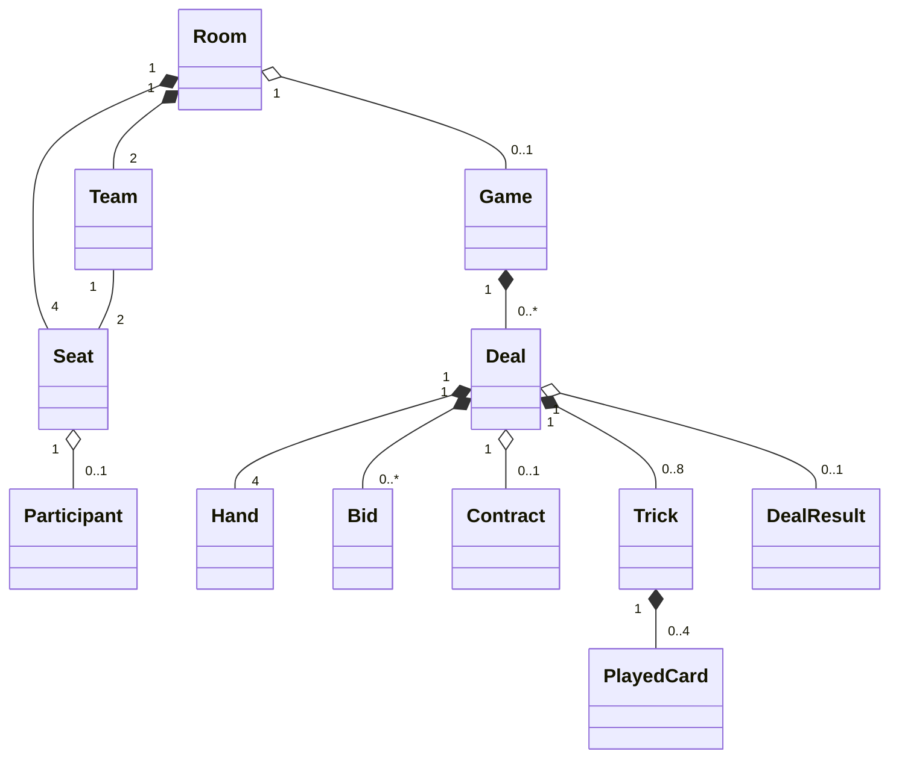

# Domain Model — Belote Contrée v1.0

## 1. Agrégats et objets

- `Room` : identifiant, code d'invitation, statut, quatre `Seat`, deux `Team`, éventuelle partie active. **Le code n'authentifie jamais un participant**.
- `Participant` : identifiant interne, pseudo temporaire, type `HUMAN | BOT`. Le token privé de reconnexion et la connexion active relèvent de Session / infrastructure, pas des règles du jeu.
- `Seat` : index `0..3`, équipe `A | B`, occupant éventuel.
- `Team` : exactement deux places opposées, score entier non négatif.
- `Game` : identifiant, état, score cible 2000, rotation du donneur, une `Deal` active au plus, résultats par donne utiles pendant la session.
- `Deal` : numéro, donneur, tour actif, phase (`BIDDING | SURCOINCHE_WINDOW | PLAYING | COMPLETE | CANCELLED`), quatre mains, enchères, contrat optionnel, jusqu'à huit plis, bonus de belote.
- `Card` : valeur immuable `(Suit, Rank)` ; 32 combinaisons uniques.
- `Hand` : ensemble de cartes actuellement détenues par une place, au plus huit.
- `Bid` : `bidderSeat`, `value = 80..160 | CAPOT`, `trumpSuit`.
- `Contract` : dernière enchère acceptée, équipe preneuse, statut `NORMAL | CONTRE | SURCONTRE`.
- `Trick` : index `0..7`, place d'entame, jusqu'à quatre `PlayedCard`, gagnant et points lorsque terminé.
- `DealResult` : points des plis (y compris bonus du dernier pli), éventuels bonus belote, statut contrat, score attribué à chaque équipe et drapeau `applied` au niveau session.

## 2. Relations

`Card`, `PlayedCard`, `Bid` et `Contract` sont des objets-valeur ; le fait de les représenter comme des classes UML n'impose pas un stockage séparé.

## 3. Invariants

- Une partie active possède quatre places occupées et deux équipes de deux.
- Au départ d'une donne : 32 cartes uniques distribuées en quatre mains de huit ; à tout instant chaque carte est soit en main, soit dans un pli en cours, soit dans un pli achevé, sans doublon.
- Une seule place active pour une action de tour ordinaire ; le contre et la fenêtre de surcontre autorisent explicitement des actions hors tour limitées.
- Tout coup accepté est légal selon le règlement ; les bots obéissent aux mêmes contrôles.
- Un pli complet a exactement quatre cartes. Une donne jouée complète a exactement huit plis, 32 cartes jouées et un seul résultat.
- Une donne annulée ne modifie aucun score. Un résultat appliqué ne peut pas l'être à nouveau.
- Une projection joueur ne contient jamais les mains non révélées des autres places.

## 4. Commandes publiques du moteur

`startDeal(state, shuffledDeck)`, `execute(state, command)`, `getLegalActions(state, seat)`, `getPlayerView(state, seat)` ; commandes `PLACE_BID`, `PASS`, `COINCHE`, `SURCOINCHE`, `DECLINE_SURCOINCHE`, `PLAY_CARD`. Le moteur retourne un nouvel état et des événements métier ou une erreur typée sans mutation.

## 5. Convention d'orientation

Indices : 0 Sud, 1 Est, 2 Nord, 3 Ouest ; partenaires 0–2 et 1–3 ; tour `0→1→2→3`. Toutes les visualisations et les tests doivent utiliser cette même convention, sans interpréter les positions physiques de la table à partir du rendu mobile.
